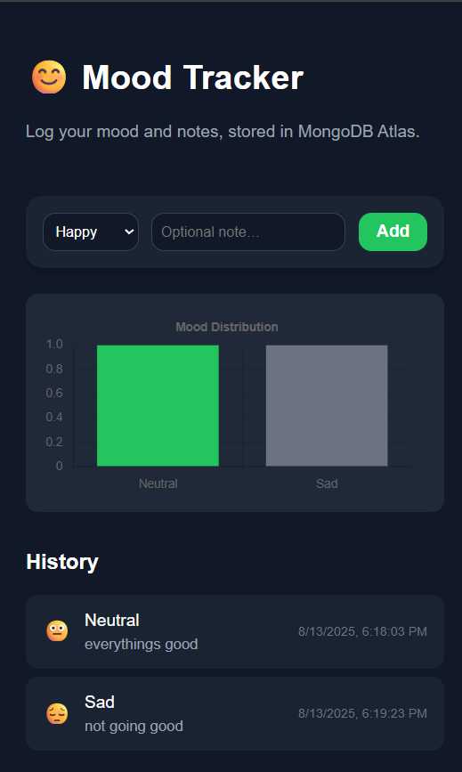
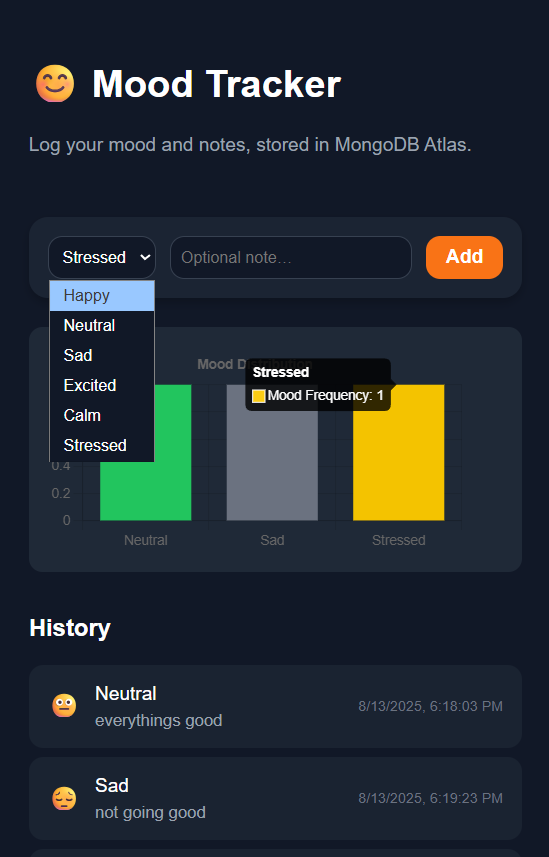
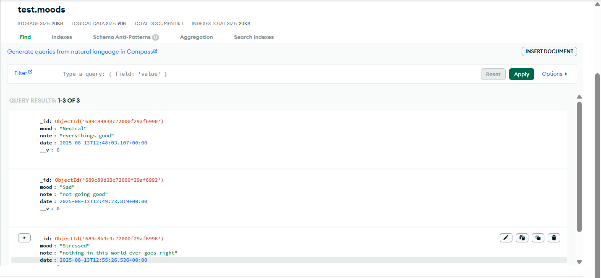

# 📊 Mood Tracker App

[](https://reactjs.org/)
[](https://nodejs.org/)
[](https://www.mongodb.com/)
[](https://www.typescriptlang.org/)
[](LICENSE)

A full-stack web application for tracking daily moods, visualizing them with charts, and storing data securely in **MongoDB Atlas**.  
Built with **React + TypeScript + Vite** for the frontend, **Node.js + Express** for the backend, and **MongoDB Atlas** as the database.

---

## ✨ Features

- **Mood Logging** – Record your daily mood with a quick form.
- **Interactive Charts** – Visualize mood trends over time.
- **MongoDB Atlas Integration** – Data is stored securely in the cloud.
- **Responsive UI** – Works on desktop and mobile.
- **Tailwind CSS** – Clean and modern styling.

---

## 📸 Screenshots

### 1️⃣ Homepage


### 2️⃣ Mood Chart Visualization


### 3️⃣ MongoDB Atlas Database View


---

## 🛠 Tech Stack

**Frontend**:
- React (TypeScript)
- Vite
- Tailwind CSS
- Chart.js (for mood visualization)

**Backend**:
- Node.js
- Express.js
- MongoDB (Atlas Cloud)
- Mongoose (ODM)

---

## 🚀 Getting Started

### 1️⃣ Clone the repository
```bash
git clone https://github.com/<your-username>/<your-repo-name>.git
cd <your-repo-name>
````

### 2️⃣ Install dependencies

**Frontend**:

```bash
cd frontend_ready
npm install
```

**Backend**:

```bash
cd backend
npm install
```

### 3️⃣ Set up environment variables

Create `.env` files in both `frontend_ready` and `backend`:

**backend/.env**

```
MONGODB_URI=your-mongodb-atlas-uri
PORT=5000
```

**frontend\_ready/.env**

```
VITE_API_URL=http://localhost:5000
```

### 4️⃣ Start the app

**Backend**:

```bash
cd backend
npm run dev
```

**Frontend**:

```bash
cd frontend_ready
npm run dev
```

---

## 🌍 Deployment

You can deploy this project using:

* **Frontend**: [Netlify](https://www.netlify.com/) / [Vercel](https://vercel.com/)
* **Backend**: [Render](https://render.com/) / [Railway](https://railway.app/) / [Heroku](https://www.heroku.com/)
* **Database**: MongoDB Atlas (Cloud)

**Example Deployment Flow**:

1. Deploy backend to Render.
2. Deploy frontend to Netlify or Vercel.
3. Update `VITE_API_URL` in `.env` to your backend’s public URL.

---

## 📊 How It Works

1. User selects their mood for the day.
2. Data is sent to the backend via API.
3. Backend saves it to MongoDB Atlas.
4. Frontend fetches all mood data and displays it in a chart.

---

## 📂 Project Structure

```
mood-tracker/
│
├── backend/              # Node.js + Express server
│   ├── routes/           # API routes
│   ├── models/           # Mongoose schemas
│   └── server.ts         # Entry point
│
├── frontend_ready/       # React + Vite + TypeScript app
│   ├── src/              # Components & pages
│   ├── App.tsx           # Main app
│   └── index.css         # Tailwind styles
│
├── .gitignore
└── README.md
```

---

## 📜 License

This project is licensed under the MIT LICENSE — you are free to use, modify, and distribute it.

---

## 👨‍💻 Author

**Mohammed Abu Hurer**
📧 [mohammedabuhurer@gmail.com](mailto:mohammedabuhurer@gmail.com)

---
